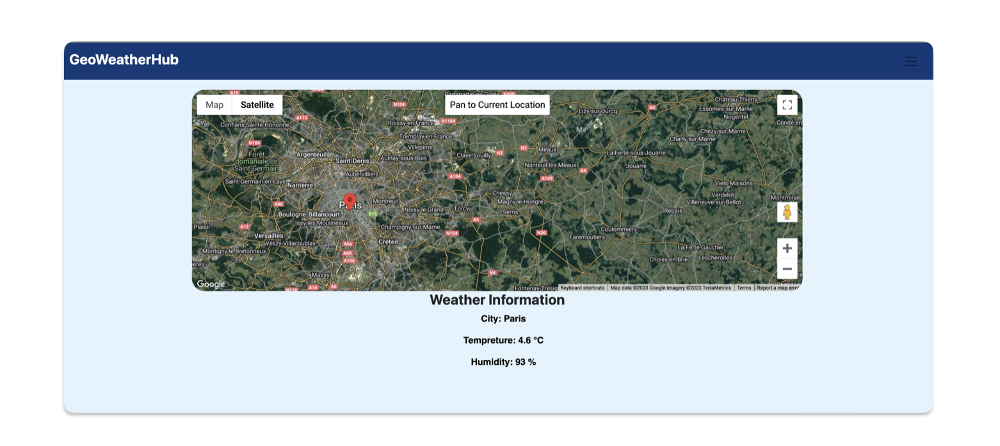

# GeoWeatherHub

GeoWeatherHub is a web application that leverages the Google Maps JavaScript API and the OpenWeatherMap API to provide weather information for pinned locations on a map. It is built using Node.js, Express.js, and GraphQL.



## Purpose

The primary purpose of GeoWeatherHub is to allow users to explore and pin locations on an interactive map and retrieve real-time weather information for those locations. Whether you're planning a trip, curious about the weather in different cities, or just want to explore weather patterns around the world, GeoWeatherHub has you covered.

## Technologies Used

- **Node.js**:
- **Express.js**:
- **GraphQL**:
- **Google Maps JavaScript API**:
- **OpenWeatherMap API**:

## Getting Started

1. **Clone the Repository:**

   ```bash
   git clone https://github.com/your-username/GeoWeatherHub.git
   cd GeoWeatherHub
   ```

   ## Configure API Keys

2. Obtain API keys for the Google Maps JavaScript API and OpenWeatherMap API.

3. Create a `.env` file in the project root and add your API keys:

   ```env
   GOOGLE_MAPS_API_KEY=your-google-maps-api-key
   OPENWEATHERMAP_API_KEY=your-openweathermap-api-key

   ```

## Usage

1. **Run the project:**

```js
npm start
```

2. **Visit the Application:**

   - Open your preferred web browser.
   - Navigate to the application at `http://localhost:3000` (or the URL where your application is hosted).

3. **Explore the Map:**

   - Use the interactive map to explore different locations.

4. **Pin Locations:**

   - Click on the map to pin locations you are interested in.

5. **View Real-Time Weather Information:**
   - Click on the pinned locations to retrieve and view real-time weather information.

Happy exploring
